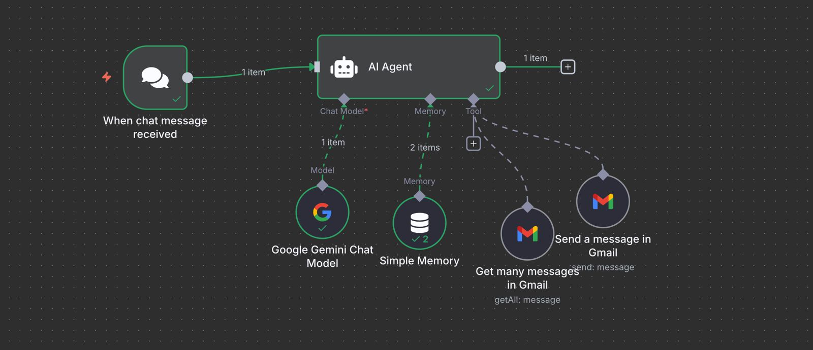

# 🤖 AI Gmail Assistant using n8n + Gemini Pro

A smart Gmail automation system that fetches specific emails (e.g., "Hackathon"), summarizes their content using Google Gemini Pro, and sends AI-generated replies — all in a **100% no-code** workflow using **n8n**.

---

## 📌 Features

- 🔍 Searches Gmail for specific topics (e.g., "mails related to hackathon")
- 🧠 Summarizes content using Gemini Pro AI
- ✉️ Sends auto-generated reply emails via Gmail
- 🧩 Built fully in n8n (no-code)
- 💸 Completely free – **no billing info required**

---

## 📹 Demo Video

Watch the working video of this project here:  
👉 [Drive Video Link](https://drive.google.com/drive/folders/1csgF2dCoj_dq6qWLiibObRiZAs0w7U8U?usp=sharing)

---

## ⚙️ Tech Stack

- [n8n](https://n8n.io/) – no-code workflow automation
- [Google Gemini Pro API](https://ai.google.dev/) – for AI summaries and email generation
- [Gmail API](https://developers.google.com/gmail/api) – for email read/write via OAuth2

---

## 🚀 How It Works

1. **Trigger:** Manual or Scheduled
2. **Search Gmail:** Searches for user-defined keyword (e.g., "Hackathon")
3. **Process Email:** Extracts subject and body text
4. **Use Gemini Pro AI:** Summarizes and generates a response
5. **Send Email:** Sends the AI-written reply via Gmail

---

## 🔐 Requirements

- n8n account (cloud or self-hosted)
- Google Gmail account
- Gemini Pro API key (Pro version; no billing required)
- Gmail OAuth2 credentials added to n8n

---

## 🧠 Prompt Used for Gemini Agent

